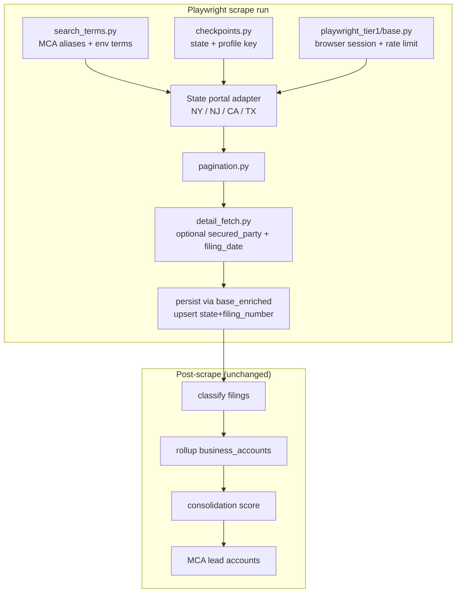

# Playwright Tier 1 scrape strategy

**Date:** May 2026  
**Target bar:** Florida (`app/scrapers/states/florida.py`) — broad coverage, enrichment, checkpoints, env caps, honest dashboard readiness, same post-scrape pipeline.

**Scope:** Playwright Tier 1 states **CA, TX, NY, NJ** (FL is REST; GA/IL/OH/MD/PA are not ready).

---

## Executive summary

NY is the primary gap (~76 filings from 10 fixed bank/equipment terms, no pagination, no `secured_party`). NJ already paginates WebForms grids but shares the same narrow term list. CA has `secured_party` on API rows but fixed terms and no checkpoints. TX has secured party on Harris County rows but no shared caps/checkpoints.

This document defines a **shared Playwright Tier 1 package** (`app/scrapers/playwright_tier1/`) and a rollout order **NY → NJ → CA → TX**. Lead detection is unchanged: post-scrape classify → rollup → consolidation score → MCA funder accounts (`mca_funder_count >= 1`).

---

## Shared architecture



| Module | Responsibility |
|--------|----------------|
| `settings.py` | `PLAYWRIGHT_SCRAPE_*` defaults + `{STATE}_SCRAPE_*` overrides |
| `search_terms.py` | Top N `mca_aliases` + env comma list + legacy bank terms fallback |
| `checkpoints.py` | `scraper_checkpoints`: profile = search term, cursor = last page index |
| `pagination.py` | ASP.NET grid pager (`Page X/Y`, `__doPostBack`) + NY xhtml_grid pager |
| `detail_fetch.py` | Optional per-row detail navigation for secured party |
| `base.py` | `PlaywrightTier1Scraper`: session, term loop, caps, structlog |

---

## Per-state portal constraints

| State | Portal | Auth | Results | Secured party | Pagination | Detail |
|-------|--------|------|---------|---------------|------------|--------|
| **FL** | REST JSON API | None | Debtor index + enrich | Enrich endpoint | `rowNumber` / profiles | `GET /Filings/{ucc}` |
| **NY** | Cenuity MVC lien search | Public (via home → Lien Search) | `#xhtml_grid` HTML | Not on grid | xhtml_grid pager (footer / next) | Lien detail link (best-effort) |
| **NJ** | WebForms non-certified | None | `orgResultsGridView` | Not on grid | `__doPostBack` Page$n | Status report (future) |
| **CA** | bizfile + `/api/Records/uccsearch` | WAF cookies | JSON rows | `SEC_PARTY` on row | API page size (future) | N/A |
| **TX** | Harris County ListView + SOS tracker | None | ListView rows | Often 2nd debtor line | ListView pages (partial) | Collateral on row |

---

## NY gap analysis vs Florida

| Capability | Florida | NY (before) | NY (target) |
|------------|---------|-------------|-------------|
| Search breadth | Multi index profiles + optional exact MCA terms | 10 fixed bank terms | Top 20 MCA aliases + `NY_SCRAPE_SEARCH_TERMS` |
| Pagination | Up to 500 pages/profile | Single results page | Up to `NY_SCRAPE_MAX_PAGES` per term |
| `secured_party` | Enrich API | Always null | Detail fetch when `NY_SCRAPE_FETCH_DETAIL=true` |
| `filing_date` | Enrich API | Grid column 6 | Grid + detail fallback |
| Checkpoints | `scraper_checkpoints` per profile | None | Per search term, page index |
| Env caps | `FL_SCRAPE_*` | None | `NY_SCRAPE_*` + `PLAYWRIGHT_SCRAPE_*` |
| Post-scrape | Full pipeline | Same (via `PostScrapeScraper`) | Same |
| Volume | 2,000+ filings/run | ~76 | Hundreds+ per full run |

**Risk:** NY may block automation (maintenance windows, bot checks). Scraper logs `portal_blocked` / `search_term_failed` and continues other terms; operator sees failures in dashboard last-run status.

---

## Rollout order

1. **NY + NJ** — Similar HTML grid + ASP.NET patterns; NJ pagination code moves into `pagination.py`.
2. **CA** — Reuse search terms + checkpoints on API pagination; secured party already on rows.
3. **TX** — Harris ListView paging + env caps; SOS tracker remains supplementary.

Readiness in `state_config.py`: **FL = `ready`**. Playwright states stay **`playwright`** until live verification shows sustained volume and secured-party coverage; operator notes document actual capabilities.

---

## Search strategies

1. **MCA lender terms** — `search_terms.load_mca_search_terms(limit=PLAYWRIGHT_SCRAPE_MCA_TERM_LIMIT)` from `mca_aliases`, then seed list if DB empty.
2. **Env extensions** — `{STATE}_SCRAPE_SEARCH_TERMS` or `PLAYWRIGHT_SCRAPE_SEARCH_TERMS` (comma-separated).
3. **Pagination** — Loop until no next page or `max_pages` per term.
4. **Optional date filters** — CA already uses `SCRAPER_FILING_LOOKBACK_DAYS`; NY/NJ public search has limited date filtering (document only).

Dedupe: in-memory per run + DB upsert on `(state, filing_number)`.

---

## Lead detection

No change to lead definition. After persist:

- `run_post_scrape_pipeline(state=...)`
- MCA leads = accounts with `mca_funder_count >= 1`

Broader scrape increases filing volume; tier distribution still depends on classifier + scorer (see `docs/florida-suppress-tier-analysis.md`).

---

## Testing strategy

| Layer | Approach |
|-------|----------|
| Unit | HTML fixtures under `tests/fixtures/playwright_tier1/` — grid parse, pager JS helpers, term loader, checkpoint keys |
| Unit | Mock Playwright `page.evaluate` / no Chromium in default `pytest` |
| Integration | Optional `@pytest.mark.slow` live NY smoke (`NY_SCRAPE_MAX_PAGES=2`) |
| Operator | `python scripts/run_state_scrape.py --state NY --quick` |

---

## Effort estimates

| Phase | Work | Estimate |
|-------|------|----------|
| 0 | This doc + config surface | 0.5 day |
| 1 | `playwright_tier1/` package | 1 day |
| 2 | NY scraper upgrade | 1–1.5 days |
| 3 | NJ/CA/TX wire-up | 1 day |
| 4 | Dashboard + `run_state_scrape` | 0.5 day |
| 5 | Fixtures + unit tests | 0.5 day |
| 6 | Live smoke + SQL verification | 0.5 day |

**Total:** ~4–5 engineering days for full four-state parity with Florida *operational* bar (excluding FL REST-specific features).

---

## Operator commands

```bash
# Quick smoke (low caps)
python scripts/run_state_scrape.py --state NY --quick

# Bounded run
NY_SCRAPE_MAX_PAGES=2 NY_SCRAPE_MAX_TERMS=3 python scripts/run_state_scrape.py --state NY

# SQL quality check
psql "$DATABASE_URL" -c "
  SELECT COUNT(*) AS n,
         ROUND(100.0 * COUNT(secured_party) / NULLIF(COUNT(*),0), 1) AS pct_secured,
         ROUND(100.0 * COUNT(filing_date) / NULLIF(COUNT(*),0), 1) AS pct_dated
  FROM ucc_filings WHERE state = 'NY';
"
```

See also: [README.md](../README.md), [florida-suppress-tier-analysis.md](florida-suppress-tier-analysis.md).
